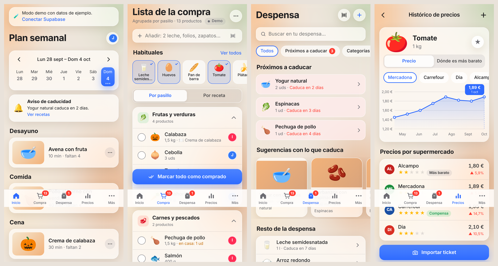

# Cesta Casa

Lista de la compra compartida, despensa, plan semanal y precios para casa. Es una PWA de un solo archivo (`index.html`) que guarda los datos en Supabase. No usa ningún servicio de pago.



## Archivos

| Archivo | Para qué sirve |
|---|---|
| `index.html` | La app entera |
| `manifest.webmanifest`, `sw.js`, `icon-*.png` | Para instalarla en el móvil como una app |
| `supabase/schema.sql` | Tablas, seguridad, tiempo real, 410 artículos ya cargados y 15 recetas de inicio |
| `supabase/actualizacion-4.sql` | Solo si ya ejecutaste el schema antes: permite añadir **súper y tiendas propias** (mercadillo, frutería…) |
| `supabase/actualizacion-3.sql` | Solo si ya ejecutaste el schema antes: guarda el **tamaño del envase** en los precios |
| `supabase/actualizacion-2.sql` | Solo si ya ejecutaste el schema antes: activa las **fotos** de recetas y productos |
| `precios/` | Precios de referencia por supermercado (tabla Excel, `referencia.json` y el conversor) |
| `img/` | Fotos por defecto que verá todo el mundo (ver `img/NOMBRES.txt`) |
| `supabase/actualizacion-1.sql` | Solo si ya ejecutaste el schema antes del 4/10/2026: permite estar en **varias casas**, salir de una y borrarla (solo quien la creó). Se puede ejecutar más de una vez |

---

## Puesta en marcha de Supabase

### 1. Crear el proyecto (3 min)
1. Entra en https://supabase.com → **New project**.
2. Nombre: `cesta-casa`. Pon una contraseña de base de datos (guárdala, aunque la app no la usa). Región: **West EU (Ireland)** o **Central EU (Frankfurt)**.
3. Espera a que termine de crearse (1-2 minutos).

### 2. Crear las tablas (1 min)
1. Menú izquierdo → **SQL Editor** → **New query**.
2. Abre [`supabase/schema.sql`](supabase/schema.sql), pulsa el botón de copiar (o **Raw** → seleccionar todo), pégalo y pulsa **Run**.
3. Debe salir **Success. No rows returned**. Si lo ejecutas otra vez no pasa nada.

### 3. Quitar la confirmación por correo (1 min)
1. **Authentication** → **Sign In / Providers** → **Email**.
2. Desactiva **Confirm email** → **Save**.

(Si lo dejas activado también funciona, pero cada uno tendrá que pulsar el enlace del correo antes de entrar.)

### 3b. Decir a Supabase dónde está la app (1 min)
Sin esto, el enlace del correo de confirmación lleva a `localhost` y da error.
1. **Authentication** → **URL Configuration**.
2. **Site URL**: `https://clauirejor.github.io/cesta-casa/` → **Save**.
3. **Redirect URLs** → **Add URL**: `https://clauirejor.github.io/cesta-casa/**` → **Save**.

### 4. Copiar la URL y la clave (1 min)
1. **Project Settings** (rueda abajo a la izquierda) → **API Keys** (o **Data API**).
2. Copia la **Project URL** (`https://xxxx.supabase.co`) y la clave **anon public** (o **publishable**, empieza por `sb_publishable_`).
3. Nunca copies la clave **service_role / secret**.

### 5. Abrir la app y crear la casa
1. **Solo una persona crea la casa.** Abre la app → **Crear cuenta nueva** → tu nombre → **Crear casa nueva**.
2. En **Más → Invitar a alguien de casa** envía el enlace y el código por WhatsApp.
3. La otra persona crea **su propia cuenta** y, en el recuadro rojo **«¿Alguien de tu casa ya usa la app?»**, pone el código → **Unirme a su casa**.
4. Cada persona puede estar en **varias casas** (la suya, la de sus padres, la de un viaje…). Se cambia tocando **🏠 nombre de la casa ▾** en Inicio o en **Más → Mis casas**, donde también se puede unir a otra casa, crear una nueva o salir de una (si se queda vacía, se borra).
5. **Borrar una casa para todos** (Más → Mis casas → Borrar): solo puede hacerlo quien la creó, y hay que pasar tres confirmaciones, la última escribiendo el nombre de la casa.

### 6. Cerrar la puerta (1 min)
Cuando estéis los dos dentro: **Authentication** → **Sign In / Providers** → desactiva **Allow new users to sign up** → **Save**. Así nadie más puede crear cuentas.

> La clave anon es pública por diseño. La seguridad la ponen las reglas del `schema.sql`: cada hogar solo ve sus datos.

### Opcional: no tener que pegar la clave en cada móvil
Edita `index.html` y, al principio del script, rellena:
```js
const CONFIG = { supabaseUrl: "https://xxxx.supabase.co", supabaseAnonKey: "tu-clave-anon" };
```

---

## Instalar en el móvil
- **iPhone (Safari):** Compartir → **Añadir a pantalla de inicio**.
- **Android (Chrome):** menú ⋮ → **Instalar aplicación**.

## Importar un ticket

1. En **Precios** (o en el menú ··· de la lista) pulsa **Importar ticket** → **Copiar instrucciones para la IA**.
2. Pega las instrucciones en la IA que uses (ChatGPT, Claude, Gemini…) junto con la foto del ticket.
3. Copia lo que te responda, pégalo en la app y pulsa **Revisar** → **Guardar ticket**.

Al guardar, se apuntan los precios, se tacha de la lista lo comprado y la comida, la limpieza y la higiene pasan a la despensa.

### Formato

```
SUPER: Mercadona
FECHA: 2026-10-04
Tomate frito; Hacendado; 2; ud; 560 g; 1,90
Plátano; ; 1,2; kg; ; 2,34
Folios; ; 1; ud; 500 hojas; 4,50
```

- Una línea por producto: **Producto; Marca; Cantidad; Unidad; Tamaño; Importe**. El tamaño es opcional (también vale sin esa columna).
- Unidad: `ud`, `kg` o `l`. El importe es lo pagado por esa línea; vale coma o punto.
- `SUPER:` y `FECHA:` son opcionales (la fecha también vale como `04/10/2026`).
- Versiones cortas que también entiende:
  - `Producto; Importe`
  - `Producto; Cantidad; Importe`
  - `Producto; Marca; Cantidad; Importe`
- También acepta columnas separadas por tabulador (copiadas de Excel o Google Sheets), líneas con viñetas (`- `) y JSON.

## Fotos

- **Desde la app:** en una receta, **Añadir foto del plato**; en un producto (lista o Mis artículos), el botón 📷. Se guardan en una carpeta privada de la casa: las ven todos sus miembros y nadie más.
- **Desde GitHub (fotos por defecto para todos):** sube `.jpg` a `img/productos/` o `img/recetas/` con el nombre de `img/NOMBRES.txt` y añade ese nombre a `img/lista.json`. La foto que suba cada casa tiene prioridad sobre la de GitHub.
- Si no hay foto, se ve el emoji.

## Precios de referencia

`precios/referencia.json` trae precios de Mercadona, Lidl, Aldi, Carrefour y Consum consultados en sus webs (o en Cestio para Mercadona) a principios de octubre de 2026. Los ve cualquier casa. Los precios de los tickets de cada casa, al ser más recientes, tienen prioridad.

Todos los precios se comparan **en proporción**, nunca por envase:
- **€/kg o €/l** en alimentación y bebidas.
- **€/unidad** en lo que se vende por piezas: huevos, rollos, cápsulas, pilas, bolsas…
- **€/lavado** en detergentes y suavizantes, y **€/metro** en film o papel de horno.

Las piezas de fruta y verdura sin peso se estiman con el peso de la pieza en otro súper y se marcan con ≈. Si un precio no tiene tamaño, se muestra pero no se usa para decir cuál es más barato.

Al apuntar un precio a mano o importar un ticket se puede indicar el **tamaño del envase** (400 g, 1 l, 6 x 1 l, 12 ud). Si no se indica, se usa el del mismo producto en ese súper.

Para actualizarlos: edita `precios/precios-supermercados.xlsx` y ejecuta `python3 precios/convertir.py` (o pásale la tabla a Claude).

## Tabla de precios por súper

En **Precios → Tabla por súper** cada fila es un producto (primero los de la lista 🛒) y cada columna un supermercado. Toca una casilla para poner o cambiar el precio; en verde sale el más barato. Las columnas se eligen con los botones de arriba.

## ¿Dónde compro?

En la pestaña **Compra** aparece la tarjeta **¿Dónde compro?**. Con los precios que habéis ido guardando (tickets y precios a mano), calcula cuánto os costaría la lista en cada supermercado y si compensa ir a dos.

- Elige los súper a los que soléis ir (por defecto Mercadona, Lidl, Aldi, Carrefour y Consum).
- **Dividir si ahorro ≥**: solo te recomienda ir a dos súper si el ahorro supera esa cantidad (por defecto 5 €).
- **Tener en cuenta la calidad**: cada estrella por encima de 3 cuenta como un 10 % más barato, y cada estrella por debajo, un 10 % más caro.
- Si a un súper le falta el precio de algún producto, se estima con la media de los demás (≈). Un súper con menos de la mitad de los precios no entra en la recomendación.
- **Apuntar el súper en cada producto** pone a cada producto el súper donde conviene comprarlo y agrupa la lista **Por súper**.

Cuantos más tickets importéis los dos, más acertada será la recomendación. Los precios no se consultan solos en internet: Lidl y Aldi no publican en su web los precios del supermercado, y Mercadona no permite leerlos de forma automática.

## Editar y quitar

- **Quitar un producto de la lista:** deslízalo hacia la izquierda y pulsa **Quitar**, o pulsa **Editar** arriba y usa los botones rojos. Siempre sale **Deshacer**. En el menú ··· está también **Vaciar la lista**.
- **Mis artículos** (Más → Mis artículos): **Nuevo artículo** para crear uno y, al editar uno, **Borrar**. Los del catálogo base dejan de salir en las sugerencias.
- **Precios:** toca la casilla de un súper para cambiarlo o **Quitar el precio**. En el detalle de un producto, **Editar** junto a cada súper y **Precio en otro súper o tienda**.
- **Súper y tiendas propias:** el botón **＋ Súper o tienda** (en la tabla de precios y en ¿Dónde compro?) o **Más → Súper y tiendas**. El Mercadillo viene ya incluido.

## Cómo se usa
- **Compra:** escribe ("2 leche", "folios", "zapatos") o toca un **Habitual**. Todo lo que apuntáis una vez queda en **Mis artículos** para volver a ponerlo con un toque. Lo de casa (papelería, ropa, bricolaje…) sale en su propio grupo.
- Al marcar algo como comprado, al otro le aparece al momento ("Jorge ha marcado Tomate frito · Hacendado · Mercadona").
- **Guardar compra:** la comida, la limpieza y la higiene pasan a la **Despensa**. Los folios o los zapatos quedan apuntados como comprados.
- **Despensa:** botones **Gastado**, **Usar 1** y **Tirado**. Si algo se acaba, la app te ofrece volver a ponerlo en la lista.
- **Precios:** histórico por súper, estrellas de calidad y la etiqueta **Compensa** (mejor calidad por euro).
- **Escanear código de barras:** busca el producto en Open Food Facts (gratis) y lo recuerda la próxima vez.
- **Plan semanal:** eliges recetas para el desayuno, la comida y la cena, y **Generar lista de la compra** añade lo que falta sin repetir lo que ya hay en la despensa.

## Límites
- Los avisos llegan con la app abierta o usada hace poco. Si está cerrada del todo, los veréis al abrirla.
- El escáner necesita permiso de cámara.
